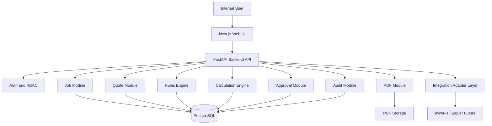
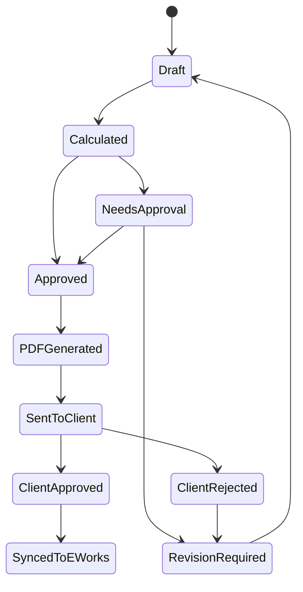
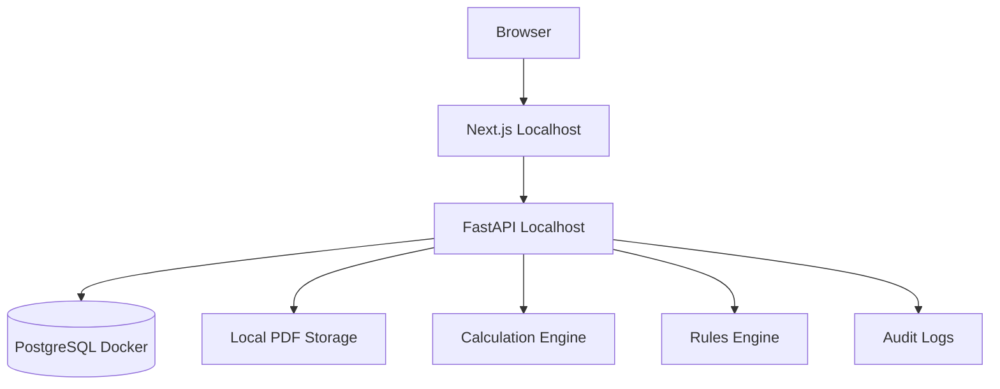
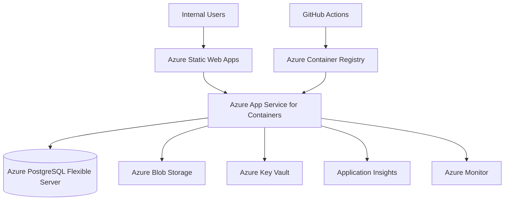
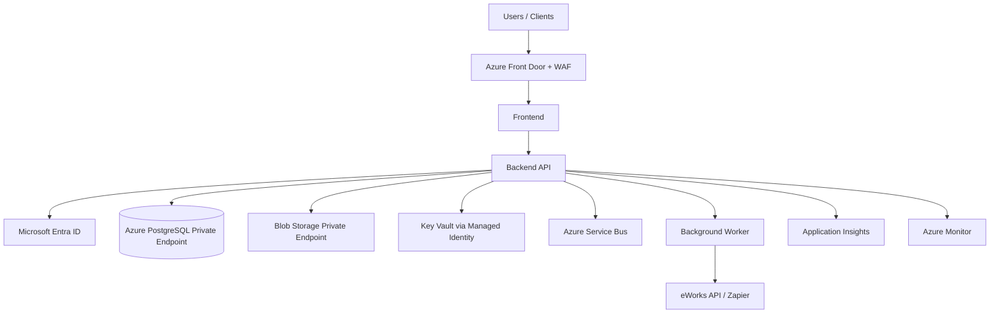

# Optimal Estimate Calculator Platform
## Phase 1, Phase 2, Phase 3 Development Plan — Cursor Ready Specification

**Document Version:** v2.0  
**Prepared For:** Optimal Group  
**Deployment Target:** Azure  
**Primary Goal:** Build a secure, extensible, production-ready estimating calculator platform.  
**Scope:** Estimating flow only.

---

## 1. Executive Summary

The project is to build a web-based estimating calculator platform for Optimal Group.

The platform must support the full estimating journey:

```text
Job details
→ Site findings
→ Scope of works
→ Labour
→ Materials
→ Parking / congestion / extra charges
→ Calculation
→ Internal review
→ Manager approval
→ Client-safe quote preview
→ Quote PDF
→ Future eWorks / Zapier sync
```

The system must not be treated as a simple calculator. It should be built as a modular business platform where the calculator is the first module.

The core principles are:

```text
1. Explainable calculations
2. Repeatable results
3. Auditable changes
4. Secure internal/client separation
5. Azure-ready deployment
6. Extensible API and UI
7. Strong unit and integration testing
```

---

## 2. Business Context

The estimating process currently depends on manual forms, spreadsheets, quote documents, and human interpretation.

The uploaded estimating questionnaire shows fields such as:

```text
Job number
Quote number
Client
Property address
Property manager
Parking notes
Congestion charge
Travel time
Description of work
Findings
Scope of works
Material supplier link
Material quantity
Material cost
Skill required
Engineer count
Time frame
Internal notes
```

The new system must transform this estimating information into a structured platform with controlled calculation logic.

---

## 3. Product Objectives

### 3.1 Core Objectives

```text
Create jobs
Create estimates/quotes
Capture site findings
Build scope of works
Add labour details
Add material line items
Add parking/congestion/extra charges
Apply client/trade rate rules
Calculate quote totals
Show internal formula breakdown
Generate client-safe quote preview
Generate draft/final PDFs
Track approvals
Track audit logs
Prepare for eWorks/Zapier integration
Deploy on Azure
```

### 3.2 Non-Objectives for Initial MVP

```text
Full eWorks native UI customisation
Supplier portal
Client login portal
Payment processing
Mobile engineer app
AI quote assistant
Power BI dashboard
Complex workflow automation
```

These can be added later.

---

## 4. High-Level Architecture



---

## 5. Recommended Tech Stack

### 5.1 Frontend

```text
Next.js
React
TypeScript
Tailwind CSS
React Hook Form
Zod
TanStack Query
shadcn/ui or custom component system
```

### 5.2 Backend

```text
FastAPI
Python 3.11+
Pydantic
SQLAlchemy
Alembic
PostgreSQL
Pytest
```

### 5.3 Azure Deployment

```text
Azure Static Web Apps or Azure App Service for frontend
Azure App Service for Containers for backend
Azure PostgreSQL Flexible Server
Azure Blob Storage
Azure Key Vault
Azure Container Registry
Application Insights
Azure Monitor
GitHub Actions
```

### 5.4 Local Development

```text
Docker Compose
Local PostgreSQL
Local PDF file storage
Local environment variables
```

---

## 6. Core Design Principles

### 6.1 Backend Is Source of Truth

The frontend can show previews, but final quote calculation must always happen on the backend.

### 6.2 Rules Must Not Be Hardcoded

Do not write pricing logic like this:

```python
if client == "Atkinson McLeod":
    rate = 75
```

Use a `rate_rules` table instead.

### 6.3 Store Calculation Snapshots

Every finalized calculation must store:

```text
Input snapshot
Rule snapshot
Output snapshot
User who calculated
Timestamp
Rule version
Formula version
```

This protects old quotes when rules change later.

### 6.4 Separate Internal and Client Views

Internal view can show:

```text
Supplier cost
Material markup
Margin
Formula breakdown
Internal notes
Rule version
```

Client view must hide:

```text
Supplier cost
Supplier links
Markup
Margin
Internal notes
Formula breakdown
Rule version
```

### 6.5 Every Important Change Must Be Audited

Track who changed what, when, and why.

---

## 7. User Roles and Permissions

### 7.1 Admin

Can do everything.

```text
Manage users
Manage roles
Manage clients
Manage trades
Manage rules
Create/edit/delete jobs
Create/edit/delete quotes
Approve quotes
View internal costs
View margins
View audit logs
Generate PDFs
Manage integrations
```

### 7.2 Estimator

```text
Create jobs
Create quotes
Edit estimate inputs
Add labour
Add materials
Add charges
Preview calculations
Submit quote for approval
Generate draft PDFs
View internal formula breakdown
```

### 7.3 Manager

```text
Review quotes
View margin
Approve quotes
Reject quotes
Request revision
Generate final PDF
View audit logs
```

### 7.4 Engineer

```text
View assigned job
Submit site findings
Suggest materials
Enter time estimate
Cannot see supplier costs
Cannot see margin
Cannot see markup
```

### 7.5 Client — Future

```text
View client-safe quote
Download PDF
Approve/reject quote
Cannot see internal data
```

---

## 8. Estimating Workflow



### 8.1 End-to-End Flow

```text
1. User logs in
2. User creates job
3. User adds client/property/contact details
4. User captures site findings
5. User creates scope of works
6. User selects trade and labour type
7. User adds labour quantity
8. User adds material line items
9. User adds parking/congestion/ULEZ/waste/other charges
10. Backend fetches matching active rate rule
11. Backend calculates quote
12. Internal formula breakdown is shown
13. Quote is saved as draft/calculated
14. Quote is submitted for approval if required
15. Manager approves or rejects
16. Client-safe PDF is generated
17. Future: quote is synced back to eWorks
```

---

## 9. API Standards

### 9.1 Versioning

All APIs must use:

```text
/api/v1/
```

### 9.2 Standard Success Response

```json
{
  "success": true,
  "data": {},
  "message": "Operation completed successfully"
}
```

### 9.3 Standard Error Response

```json
{
  "success": false,
  "error_code": "RATE_RULE_NOT_FOUND",
  "message": "No active rate rule found for this client and trade.",
  "field": "trade",
  "suggested_action": "Create or activate a rate rule."
}
```

### 9.4 Required Error Codes

```text
UNAUTHORIZED_ACCESS
FORBIDDEN
VALIDATION_ERROR
JOB_NOT_FOUND
QUOTE_NOT_FOUND
CLIENT_NOT_FOUND
TRADE_NOT_FOUND
RATE_RULE_NOT_FOUND
INVALID_MATERIAL_COST
INVALID_LABOUR_INPUT
APPROVAL_REQUIRED
PDF_GENERATION_FAILED
PDF_ACCESS_DENIED
EWORKS_SYNC_FAILED
ZAPIER_WEBHOOK_FAILED
DUPLICATE_REQUEST
IDEMPOTENCY_KEY_REQUIRED
DATABASE_ERROR
STORAGE_ERROR
```

### 9.5 Idempotency

Use idempotency keys for all mutation endpoints that may be retried.

```text
POST /api/v1/quotes
POST /api/v1/calculations/finalize
POST /api/v1/quotes/{id}/generate-pdf
POST /api/v1/quotes/{id}/approve
POST /api/v1/integrations/eworks/sync
```

Header:

```http
Idempotency-Key: job_33075_quote_v1
```

### 9.6 Pagination

All list endpoints must support:

```text
page
limit
sort_by
sort_order
search
status
client_id
date_from
date_to
```

Example:

```text
GET /api/v1/quotes?page=1&limit=25&status=draft&client_id=abc
```

---

## 10. Core API Endpoints

### 10.1 Auth

```text
POST /api/v1/auth/register
POST /api/v1/auth/login
GET  /api/v1/auth/me
POST /api/v1/auth/logout
POST /api/v1/auth/refresh
```

### 10.2 Users

```text
GET    /api/v1/users
POST   /api/v1/users
GET    /api/v1/users/{user_id}
PATCH  /api/v1/users/{user_id}
DELETE /api/v1/users/{user_id}
```

### 10.3 Clients

```text
GET    /api/v1/clients
POST   /api/v1/clients
GET    /api/v1/clients/{client_id}
PATCH  /api/v1/clients/{client_id}
DELETE /api/v1/clients/{client_id}
```

### 10.4 Trades

```text
GET    /api/v1/trades
POST   /api/v1/trades
GET    /api/v1/trades/{trade_id}
PATCH  /api/v1/trades/{trade_id}
DELETE /api/v1/trades/{trade_id}
```

### 10.5 Jobs

```text
GET    /api/v1/jobs
POST   /api/v1/jobs
GET    /api/v1/jobs/{job_id}
PATCH  /api/v1/jobs/{job_id}
DELETE /api/v1/jobs/{job_id}
GET    /api/v1/jobs/{job_id}/quotes
```

### 10.6 Quotes

```text
GET    /api/v1/quotes
POST   /api/v1/quotes
GET    /api/v1/quotes/{quote_id}
PATCH  /api/v1/quotes/{quote_id}
DELETE /api/v1/quotes/{quote_id}

POST   /api/v1/quotes/{quote_id}/submit-for-approval
POST   /api/v1/quotes/{quote_id}/approve
POST   /api/v1/quotes/{quote_id}/reject
POST   /api/v1/quotes/{quote_id}/request-revision

GET    /api/v1/quotes/{quote_id}/internal-view
GET    /api/v1/quotes/{quote_id}/client-view
GET    /api/v1/quotes/{quote_id}/audit
GET    /api/v1/quotes/{quote_id}/snapshots
```

### 10.7 Calculations

```text
POST /api/v1/calculations/preview
POST /api/v1/calculations/finalize
GET  /api/v1/calculations/{quote_id}/breakdown
POST /api/v1/calculations/test-rule
```

### 10.8 Rules

```text
GET    /api/v1/rules
POST   /api/v1/rules
GET    /api/v1/rules/{rule_id}
PATCH  /api/v1/rules/{rule_id}
DELETE /api/v1/rules/{rule_id}
POST   /api/v1/rules/{rule_id}/activate
POST   /api/v1/rules/{rule_id}/deactivate
POST   /api/v1/rules/test
GET    /api/v1/rules/history
```

### 10.9 Documents

```text
POST /api/v1/documents/quote-pdf
GET  /api/v1/documents/{document_id}
GET  /api/v1/documents/{document_id}/download
DELETE /api/v1/documents/{document_id}
```

### 10.10 Audit Logs

```text
GET /api/v1/audit-logs
GET /api/v1/audit-logs/{entity_type}/{entity_id}
```

### 10.11 Integrations — Future/Stub in Phase 1

```text
POST /api/v1/integrations/eworks/import-job
POST /api/v1/integrations/eworks/sync-quote
POST /api/v1/integrations/eworks/attach-pdf
POST /api/v1/integrations/zapier/webhook
GET  /api/v1/integrations/events
POST /api/v1/integrations/events/{event_id}/retry
```

---

## 11. UI Standards

### 11.1 Required Pages

```text
/login
/dashboard
/jobs
/jobs/new
/jobs/[id]
/jobs/[id]/quote
/quotes
/quotes/[id]
/quotes/[id]/internal
/quotes/[id]/client-preview
/quotes/[id]/audit
/clients
/trades
/rules
/rules/new
/admin/users
/settings
```

### 11.2 Step-Based Estimate Form

The estimating UI must be step-based.

```text
Step 1: Job Details
Step 2: Site Findings
Step 3: Scope of Works
Step 4: Labour
Step 5: Materials
Step 6: Parking / Congestion / ULEZ / Extra Charges
Step 7: Calculation Preview
Step 8: Internal Review
Step 9: Approval
Step 10: Client Preview / PDF
```

### 11.3 Required UI Behaviours

```text
Auto-save draft
Manual save button
Unsaved changes warning
Field-level validation
Field-level help text
Calculation preview panel
Internal/client view toggle
Missing information warnings
Status badges
Loading states
Error states
Empty states
Toast notifications
Confirmation modals for destructive actions
Revision comparison view
```

### 11.4 Internal Formula Breakdown

Show internally:

```text
Labour = engineers × quantity × rate
Material = quantity × unit cost + delivery + markup
Parking = rate × hours or fixed amount
Congestion = yes/no amount
ULEZ = yes/no amount
VAT = subtotal × VAT rate
Final total
Rule version used
Formula version used
Approval requirement reason
```

### 11.5 Client-Safe Preview

Hide:

```text
Supplier cost
Supplier link
Markup
Margin
Internal notes
Rate rule version
Formula breakdown
Engineer cost
```

Show:

```text
Company branding
Quote number
Job number
Client
Property address
Date
Scope of works
Attendance summary
Materials summary if applicable
Parking/congestion if chargeable
Subtotal
VAT
Final total
Terms and conditions
```

---

## 12. Form Data Requirements

### 12.1 Job Details

```text
Job Number
Quote Number
External eWorks Job ID
Client
Property Address
Property Manager Name
Property Manager Email
Property Manager Phone
Tenant Name
Tenant Phone
Access Notes
Engineer Name
Date Visited
Travel Time Minutes
Original Job Description
```

### 12.2 Site Findings

```text
Access Confirmed
Tenant Call Required
Engineer Findings
Problem Summary
Photos/Future Attachments
```

### 12.3 Scope of Works

Each scope item:

```text
Description
Client Visible
Internal Only
Sort Order
Template ID optional
```

### 12.4 Labour

```text
Trade
Skill Required
Best Engineer
Labour Type: hourly / half_day / day
Number of Engineers
Hours On Site
Days On Site
Manual Labour Override
Manual Labour Rate
Override Reason
```

### 12.5 Materials

Each material item:

```text
Material Name
Supplier Name
Supplier Link
Quantity
Unit Cost
Delivery Cost
Markup Type: percentage / fixed / none
Markup Value
Client Visible
Internal Notes
Availability Status
Lead Time optional
```

### 12.6 Charges

```text
Parking Required
Parking Type: hourly / fixed / included / not_chargeable
Parking Rate Per Hour
Parking Hours
Parking Fixed Amount

Congestion Required
Congestion Amount

ULEZ Required
ULEZ Amount

Waste Disposal Required
Waste Disposal Amount

Travel Charge
Other Charge
Other Charge Reason
```

---

## 13. Calculation Rules

### 13.1 Labour Calculation

```text
Hourly Labour Total = Engineers × Hours × Hourly Rate
Half-Day Labour Total = Engineers × Half-Day Rate
Day Labour Total = Engineers × Days × Day Rate
```

### 13.2 Minimum Charge

```text
If labour total < minimum charge:
    labour total = minimum charge
```

### 13.3 Materials

```text
Material Base Cost = Quantity × Unit Cost + Delivery Cost
Material Markup = Base Cost × Markup %
Material Sell Total = Base Cost + Markup
```

For fixed markup:

```text
Material Sell Total = Base Cost + Fixed Markup
```

For no markup:

```text
Material Sell Total = Base Cost
```

### 13.4 Parking

```text
If parking type = hourly:
    Parking Total = Parking Rate Per Hour × Parking Hours

If parking type = fixed:
    Parking Total = Parking Fixed Amount

If parking type = included or not_chargeable:
    Parking Total = 0
```

### 13.5 Congestion

```text
If Congestion Required = true:
    Congestion Total = Congestion Amount
Else:
    Congestion Total = 0
```

### 13.6 ULEZ

```text
If ULEZ Required = true:
    ULEZ Total = ULEZ Amount
Else:
    ULEZ Total = 0
```

### 13.7 VAT

```text
VAT = Subtotal × VAT Rate
```

### 13.8 Final Total

```text
Subtotal =
Labour Total
+ Material Sell Total
+ Parking Total
+ Congestion Total
+ ULEZ Total
+ Waste Disposal Total
+ Travel Charge
+ Other Charge

Final Total = Subtotal + VAT
```

### 13.9 Rounding

Configurable settings:

```text
Round labour hours to nearest 0.5
Round money to 2 decimals
Round VAT to 2 decimals
Round final quote to nearest £1 only if enabled
```

---

## 14. Approval Rules

A quote should require manager approval if:

```text
Final quote total > configured threshold
Margin below minimum margin
Manual rate override used
Manual discount used
No matching active rate rule found
Material cost exceeds threshold
Other charge is added without reason
Labour hours exceed configured limit
Quote was revised after approval
```

Approval fields:

```text
Requested by
Approved by
Approval status
Approval reason
Rejection reason
Approval timestamp
```

---

## 15. Database Schema

### 15.1 users

```sql
CREATE TABLE users (
    id UUID PRIMARY KEY,
    email VARCHAR(255) UNIQUE NOT NULL,
    full_name VARCHAR(255) NOT NULL,
    password_hash TEXT NOT NULL,
    role VARCHAR(50) NOT NULL,
    is_active BOOLEAN DEFAULT TRUE,
    created_at TIMESTAMP DEFAULT NOW(),
    updated_at TIMESTAMP DEFAULT NOW()
);
```

### 15.2 clients

```sql
CREATE TABLE clients (
    id UUID PRIMARY KEY,
    name VARCHAR(255) UNIQUE NOT NULL,
    billing_email VARCHAR(255),
    default_vat_rate NUMERIC(5,2) DEFAULT 20.00,
    is_active BOOLEAN DEFAULT TRUE,
    created_at TIMESTAMP DEFAULT NOW(),
    updated_at TIMESTAMP DEFAULT NOW()
);
```

### 15.3 trades

```sql
CREATE TABLE trades (
    id UUID PRIMARY KEY,
    name VARCHAR(255) UNIQUE NOT NULL,
    description TEXT,
    is_active BOOLEAN DEFAULT TRUE,
    created_at TIMESTAMP DEFAULT NOW(),
    updated_at TIMESTAMP DEFAULT NOW()
);
```

### 15.4 jobs

```sql
CREATE TABLE jobs (
    id UUID PRIMARY KEY,
    job_number VARCHAR(100) UNIQUE NOT NULL,
    external_eworks_job_id VARCHAR(100),
    client_id UUID REFERENCES clients(id),
    property_address TEXT NOT NULL,
    property_manager_name VARCHAR(255),
    property_manager_email VARCHAR(255),
    property_manager_phone VARCHAR(100),
    tenant_name VARCHAR(255),
    tenant_phone VARCHAR(100),
    access_notes TEXT,
    original_job_description TEXT,
    engineer_name VARCHAR(255),
    date_visited DATE,
    travel_time_minutes INTEGER DEFAULT 0,
    created_by UUID REFERENCES users(id),
    created_at TIMESTAMP DEFAULT NOW(),
    updated_at TIMESTAMP DEFAULT NOW()
);
```

### 15.5 job_findings

```sql
CREATE TABLE job_findings (
    id UUID PRIMARY KEY,
    job_id UUID REFERENCES jobs(id) ON DELETE CASCADE,
    findings TEXT NOT NULL,
    problem_summary TEXT,
    access_confirmed BOOLEAN DEFAULT FALSE,
    tenant_call_required BOOLEAN DEFAULT FALSE,
    created_by UUID REFERENCES users(id),
    created_at TIMESTAMP DEFAULT NOW()
);
```

### 15.6 quotes

```sql
CREATE TABLE quotes (
    id UUID PRIMARY KEY,
    quote_number VARCHAR(100) UNIQUE NOT NULL,
    job_id UUID REFERENCES jobs(id) ON DELETE CASCADE,
    status VARCHAR(50) DEFAULT 'draft',
    rule_version VARCHAR(100),
    formula_version VARCHAR(100),
    template_version VARCHAR(100),
    subtotal NUMERIC(12,2) DEFAULT 0,
    vat_rate NUMERIC(5,2) DEFAULT 20.00,
    vat_total NUMERIC(12,2) DEFAULT 0,
    final_total NUMERIC(12,2) DEFAULT 0,
    margin_total NUMERIC(12,2),
    internal_notes TEXT,
    client_notes TEXT,
    created_by UUID REFERENCES users(id),
    approved_by UUID REFERENCES users(id),
    approved_at TIMESTAMP,
    created_at TIMESTAMP DEFAULT NOW(),
    updated_at TIMESTAMP DEFAULT NOW()
);
```

### 15.7 quote_scope_items

```sql
CREATE TABLE quote_scope_items (
    id UUID PRIMARY KEY,
    quote_id UUID REFERENCES quotes(id) ON DELETE CASCADE,
    description TEXT NOT NULL,
    client_visible BOOLEAN DEFAULT TRUE,
    internal_only BOOLEAN DEFAULT FALSE,
    sort_order INTEGER DEFAULT 0,
    created_at TIMESTAMP DEFAULT NOW()
);
```

### 15.8 quote_labour

```sql
CREATE TABLE quote_labour (
    id UUID PRIMARY KEY,
    quote_id UUID REFERENCES quotes(id) ON DELETE CASCADE,
    trade_id UUID REFERENCES trades(id),
    skill_required VARCHAR(255),
    best_engineer VARCHAR(255),
    labour_type VARCHAR(50) NOT NULL,
    number_of_engineers INTEGER NOT NULL,
    hours_on_site NUMERIC(8,2),
    days_on_site NUMERIC(8,2),
    rate_used NUMERIC(12,2),
    labour_total NUMERIC(12,2),
    manual_override BOOLEAN DEFAULT FALSE,
    manual_rate NUMERIC(12,2),
    override_reason TEXT,
    created_at TIMESTAMP DEFAULT NOW()
);
```

### 15.9 quote_materials

```sql
CREATE TABLE quote_materials (
    id UUID PRIMARY KEY,
    quote_id UUID REFERENCES quotes(id) ON DELETE CASCADE,
    material_name VARCHAR(255) NOT NULL,
    supplier_name VARCHAR(255),
    supplier_link TEXT,
    quantity NUMERIC(10,2) NOT NULL,
    unit_cost NUMERIC(12,2) NOT NULL,
    delivery_cost NUMERIC(12,2) DEFAULT 0,
    markup_type VARCHAR(50) DEFAULT 'percentage',
    markup_value NUMERIC(8,2) DEFAULT 0,
    base_cost NUMERIC(12,2),
    markup_total NUMERIC(12,2),
    sell_total NUMERIC(12,2),
    client_visible BOOLEAN DEFAULT TRUE,
    internal_notes TEXT,
    created_at TIMESTAMP DEFAULT NOW()
);
```

### 15.10 quote_charges

```sql
CREATE TABLE quote_charges (
    id UUID PRIMARY KEY,
    quote_id UUID REFERENCES quotes(id) ON DELETE CASCADE,
    parking_required BOOLEAN DEFAULT FALSE,
    parking_type VARCHAR(50),
    parking_rate_per_hour NUMERIC(12,2),
    parking_hours NUMERIC(8,2),
    parking_fixed_amount NUMERIC(12,2),
    parking_total NUMERIC(12,2) DEFAULT 0,
    congestion_required BOOLEAN DEFAULT FALSE,
    congestion_amount NUMERIC(12,2) DEFAULT 0,
    ulez_required BOOLEAN DEFAULT FALSE,
    ulez_amount NUMERIC(12,2) DEFAULT 0,
    waste_disposal_required BOOLEAN DEFAULT FALSE,
    waste_disposal_amount NUMERIC(12,2) DEFAULT 0,
    travel_charge NUMERIC(12,2) DEFAULT 0,
    other_charge NUMERIC(12,2) DEFAULT 0,
    other_charge_reason TEXT,
    created_at TIMESTAMP DEFAULT NOW()
);
```

### 15.11 rate_rules

```sql
CREATE TABLE rate_rules (
    id UUID PRIMARY KEY,
    client_id UUID REFERENCES clients(id),
    trade_id UUID REFERENCES trades(id),
    version VARCHAR(100) NOT NULL,
    hourly_rate NUMERIC(12,2),
    half_day_rate NUMERIC(12,2),
    day_rate NUMERIC(12,2),
    minimum_hours NUMERIC(8,2),
    minimum_charge NUMERIC(12,2),
    material_markup_type VARCHAR(50) DEFAULT 'percentage',
    material_markup_value NUMERIC(8,2) DEFAULT 0,
    vat_rate NUMERIC(5,2) DEFAULT 20.00,
    rounding_rule VARCHAR(100),
    active_from DATE NOT NULL,
    active_to DATE,
    is_active BOOLEAN DEFAULT TRUE,
    created_at TIMESTAMP DEFAULT NOW()
);
```

### 15.12 calculation_snapshots

```sql
CREATE TABLE calculation_snapshots (
    id UUID PRIMARY KEY,
    quote_id UUID REFERENCES quotes(id) ON DELETE CASCADE,
    input_snapshot JSONB NOT NULL,
    rule_snapshot JSONB NOT NULL,
    output_snapshot JSONB NOT NULL,
    calculated_by UUID REFERENCES users(id),
    calculated_at TIMESTAMP DEFAULT NOW()
);
```

### 15.13 approvals

```sql
CREATE TABLE approvals (
    id UUID PRIMARY KEY,
    quote_id UUID REFERENCES quotes(id) ON DELETE CASCADE,
    requested_by UUID REFERENCES users(id),
    approved_by UUID REFERENCES users(id),
    status VARCHAR(50) DEFAULT 'pending',
    approval_reason TEXT,
    rejection_reason TEXT,
    created_at TIMESTAMP DEFAULT NOW(),
    updated_at TIMESTAMP DEFAULT NOW()
);
```

### 15.14 documents

```sql
CREATE TABLE documents (
    id UUID PRIMARY KEY,
    quote_id UUID REFERENCES quotes(id) ON DELETE CASCADE,
    document_type VARCHAR(50) NOT NULL,
    file_path TEXT NOT NULL,
    file_name VARCHAR(255) NOT NULL,
    template_version VARCHAR(100),
    is_draft BOOLEAN DEFAULT TRUE,
    generated_by UUID REFERENCES users(id),
    generated_at TIMESTAMP DEFAULT NOW()
);
```

### 15.15 audit_logs

```sql
CREATE TABLE audit_logs (
    id UUID PRIMARY KEY,
    user_id UUID REFERENCES users(id),
    action VARCHAR(255) NOT NULL,
    entity_type VARCHAR(100) NOT NULL,
    entity_id UUID,
    old_value JSONB,
    new_value JSONB,
    ip_address VARCHAR(100),
    created_at TIMESTAMP DEFAULT NOW()
);
```

### 15.16 integration_events

```sql
CREATE TABLE integration_events (
    id UUID PRIMARY KEY,
    event_id VARCHAR(255) UNIQUE,
    source_system VARCHAR(100),
    target_system VARCHAR(100),
    entity_type VARCHAR(100),
    entity_id UUID,
    status VARCHAR(50),
    request_payload JSONB,
    response_payload JSONB,
    error_message TEXT,
    retry_count INTEGER DEFAULT 0,
    created_at TIMESTAMP DEFAULT NOW(),
    updated_at TIMESTAMP DEFAULT NOW()
);
```

### 15.17 idempotency_keys

```sql
CREATE TABLE idempotency_keys (
    id UUID PRIMARY KEY,
    key VARCHAR(255) UNIQUE NOT NULL,
    request_hash TEXT NOT NULL,
    response_payload JSONB,
    status_code INTEGER,
    created_at TIMESTAMP DEFAULT NOW(),
    expires_at TIMESTAMP
);
```

---

## 16. Testing Strategy

Testing is mandatory, not optional.

### 16.1 Test Pyramid

```text
Unit Tests
Integration Tests
API Contract Tests
Database Migration Tests
Security Tests
Frontend Component Tests
End-to-End Tests
Smoke Tests
Regression Tests
```

---

## 17. Unit Testing Plan

### 17.1 Backend Unit Tests

Use:

```text
pytest
pytest-cov
pytest-asyncio
factory_boy or custom factories
freezegun for time-based tests
```

### 17.2 Unit Test Coverage Target

```text
Minimum coverage: 80%
Calculation engine coverage: 95%+
Rules engine coverage: 95%+
Security/permissions coverage: 90%+
```

### 17.3 Calculation Engine Unit Tests

Create:

```text
backend/tests/unit/test_calculation_engine.py
```

Required test cases:

```text
test_hourly_labour_single_engineer
test_hourly_labour_multiple_engineers
test_half_day_labour
test_day_labour
test_minimum_hours_applied
test_minimum_charge_applied
test_material_markup_percentage
test_material_markup_fixed
test_material_no_markup
test_material_delivery_cost_added
test_parking_hourly
test_parking_fixed
test_parking_included
test_congestion_yes
test_congestion_no
test_ulez_yes
test_ulez_no
test_waste_disposal_added
test_other_charge_requires_reason
test_vat_calculation
test_rounding_to_two_decimals
test_final_total_calculation
test_approval_required_for_high_quote_value
test_approval_required_for_manual_override
test_approval_required_for_low_margin
test_no_rate_rule_found_returns_warning
```

Example:

```python
def test_hourly_labour_single_engineer():
    result = calculate_labour(
        labour_type="hourly",
        engineers=1,
        hours=2,
        hourly_rate=75,
        half_day_rate=None,
        day_rate=None,
        minimum_hours=None,
        minimum_charge=None,
    )

    assert result.total == 150
    assert result.formula == "1 × 2 × 75"
```

### 17.4 Rules Engine Unit Tests

Create:

```text
backend/tests/unit/test_rules_engine.py
```

Required test cases:

```text
test_find_active_rule_by_client_and_trade
test_ignore_inactive_rule
test_use_rule_with_valid_active_date
test_do_not_use_expired_rule
test_rule_version_returned
test_missing_rule_raises_domain_error
test_duplicate_active_rules_handled
test_material_markup_from_rule_applied
test_vat_from_rule_applied
```

### 17.5 Approval Logic Unit Tests

Create:

```text
backend/tests/unit/test_approval_rules.py
```

Required test cases:

```text
test_approval_required_when_total_exceeds_threshold
test_approval_not_required_below_threshold
test_approval_required_for_manual_rate_override
test_approval_required_when_margin_below_minimum
test_approval_required_when_material_cost_high
test_approval_required_when_other_charge_without_reason
test_approval_required_when_no_rate_rule
```

### 17.6 Permission Unit Tests

Create:

```text
backend/tests/unit/test_permissions.py
```

Required test cases:

```text
test_admin_can_manage_rules
test_estimator_cannot_approve_quote
test_manager_can_approve_quote
test_engineer_cannot_view_internal_breakdown
test_client_cannot_view_internal_fields
test_estimator_can_generate_draft_pdf
test_final_pdf_requires_approval
```

### 17.7 PDF Unit Tests

Create:

```text
backend/tests/unit/test_pdf_service.py
```

Required test cases:

```text
test_draft_pdf_has_draft_watermark
test_final_pdf_has_no_draft_watermark
test_client_pdf_does_not_include_supplier_cost
test_client_pdf_does_not_include_markup
test_client_pdf_does_not_include_internal_notes
test_pdf_metadata_saved
test_pdf_generation_failure_handled
```

### 17.8 Audit Unit Tests

Create:

```text
backend/tests/unit/test_audit_service.py
```

Required test cases:

```text
test_audit_log_created_on_quote_update
test_audit_log_contains_old_and_new_values
test_audit_log_contains_user_id
test_audit_log_contains_timestamp
test_audit_log_created_on_approval
test_audit_log_created_on_pdf_generation
```

### 17.9 Storage Unit Tests

Create:

```text
backend/tests/unit/test_storage_service.py
```

Required test cases:

```text
test_local_storage_upload
test_local_storage_download
test_azure_blob_storage_upload_mocked
test_private_url_generation
test_signed_url_expiry
test_storage_failure_returns_error
```

---

## 18. Integration Testing Plan

### 18.1 API Integration Tests

Use test database.

Create:

```text
backend/tests/integration/
```

Required tests:

```text
test_create_client
test_create_trade
test_create_rate_rule
test_create_job
test_create_quote
test_add_labour_to_quote
test_add_material_to_quote
test_add_charges_to_quote
test_preview_calculation
test_finalize_calculation
test_submit_quote_for_approval
test_approve_quote
test_generate_final_pdf
test_get_internal_view
test_get_client_view
```

### 18.2 Database Integration Tests

Required tests:

```text
test_alembic_migrations_apply_cleanly
test_foreign_key_constraints
test_quote_delete_cascades_scope_items
test_quote_delete_cascades_materials
test_unique_job_number_enforced
test_unique_quote_number_enforced
```

### 18.3 Integration Event Tests

Required tests:

```text
test_zapier_webhook_event_saved
test_duplicate_event_ignored
test_failed_event_can_be_retried
test_eworks_sync_stub_creates_event_log
```

---

## 19. API Contract Testing

Every API must match its documented request/response schema.

Required tests:

```text
test_calculation_preview_response_schema
test_quote_internal_view_schema
test_quote_client_view_schema
test_error_response_schema
test_paginated_response_schema
test_auth_response_schema
```

Use:

```text
Pydantic models
OpenAPI schema validation
Schemathesis optional
```

---

## 20. Frontend Testing Plan

### 20.1 Unit/Component Tests

Use:

```text
Vitest
React Testing Library
```

Required tests:

```text
test_login_form_validation
test_job_form_required_fields
test_quote_stepper_navigation
test_labour_form_validation
test_material_form_validation
test_charges_form_validation
test_calculation_preview_panel
test_internal_view_shows_formula_breakdown
test_client_preview_hides_internal_fields
test_status_badges_render_correctly
test_permission_based_menu_visibility
```

### 20.2 E2E Tests

Use:

```text
Playwright
```

Required E2E flows:

```text
Admin logs in and creates client
Admin creates trade
Admin creates rate rule
Estimator creates job
Estimator creates quote
Estimator adds labour/materials/charges
Estimator previews calculation
Estimator submits for approval
Manager approves quote
Estimator generates final PDF
Client preview does not show internal data
```

### 20.3 Frontend Security Tests

```text
Engineer cannot open internal quote page
Estimator cannot open admin users page
Client preview route cannot expose internal fields
Unauthenticated user redirected to login
Expired session redirected to login
```

---

## 21. Regression Testing

Create fixed regression scenarios using sample data.

### 21.1 Regression Case 1: Basic Hourly Job

```text
Client: Napier Watt
Trade: Handyman
Engineers: 1
Hours: 2
Hourly rate: 75
Material cost: 82.49
Material markup: 20%
Parking: 6.50 × 2
Congestion: No
VAT: 20%
```

Expected calculation:

```text
Labour = 150.00
Material base = 82.49
Material markup = 16.50
Material sell = 98.99
Parking = 13.00
Congestion = 0.00
Subtotal = 261.99
VAT = 52.40
Final = 314.39
```

### 21.2 Regression Case 2: Congestion Yes

```text
Same as above
Congestion = 15.00
```

Expected:

```text
Final total increases by 18.00 including 20% VAT
```

### 21.3 Regression Case 3: Minimum Charge Applied

```text
Hours: 1
Hourly rate: 50
Minimum charge: 120
```

Expected:

```text
Labour total = 120
```

### 21.4 Regression Case 4: Manual Override Requires Approval

```text
Manual labour rate override = true
```

Expected:

```text
requires_approval = true
approval_reason contains manual override
```

---

## 22. Security Testing

Required tests:

```text
JWT required for protected endpoints
Invalid token rejected
Expired token rejected
Role permission enforced
Client view hides internal fields
PDF download requires permission
CORS locked to approved domains
Secrets not exposed in frontend bundle
Webhook signature validation
SQL injection attempts rejected
XSS input escaped in UI and PDF
```

---

## 23. Performance Testing

Minimum targets:

```text
Calculation preview < 300ms
Quote internal view < 500ms
Quote list < 2 seconds
PDF generation < 10 seconds
Login < 1 second
```

Use:

```text
Locust or k6 later
Basic pytest timing checks in MVP
```

---

## 24. CI/CD Quality Gates

CI must fail if:

```text
Backend tests fail
Frontend build fails
Frontend lint fails
Backend lint fails
Security scan fails on high severity issue
Coverage below threshold
Alembic migration check fails
Docker build fails
```

Backend GitHub Actions should run:

```text
pytest
pytest --cov
ruff or flake8
black --check
bandit
alembic upgrade head on test DB
docker build
```

Frontend GitHub Actions should run:

```text
npm install
npm run lint
npm run typecheck
npm run test
npm run build
```

---

## 25. Observability Requirements

Track logs and metrics for:

```text
quote_created
quote_updated
quote_calculated
quote_submitted_for_approval
quote_approved
quote_rejected
pdf_generated
pdf_generation_failed
client_preview_opened
eworks_sync_started
eworks_sync_failed
webhook_received
webhook_failed
```

Metrics:

```text
API latency
API error rate
Calculation count
PDF generation count
Failed PDF count
Quote approval count
Average approval time
Database error count
Authentication failures
```

---

## 26. Phase 1 — Local MVP Development

### 26.1 Objective

Build the working local product with full estimating logic.

### 26.2 Phase 1 Architecture



### 26.3 Phase 1 Must-Have Features

```text
Local Docker Compose
FastAPI backend
Next.js frontend
PostgreSQL
JWT auth
Roles
Client CRUD
Trade CRUD
Rate rules CRUD
Job CRUD
Quote CRUD
Step-based estimating form
Labour/material/charges
Calculation preview
Calculation finalize
Internal formula breakdown
Client-safe preview
Approval flow
Draft PDF
Final PDF
Audit logs
Calculation snapshots
Unit tests
Integration tests
Basic E2E test
```

### 26.4 Phase 1 Deliverables

```text
Working local app
Backend API documentation
Database migrations
Seed data
Test suite
Docker Compose
README
Cursor-ready folder structure
```

### 26.5 Phase 1 Acceptance Criteria

```text
App runs locally with Docker Compose
Admin can create clients/trades/rules
Estimator can create job and quote
Calculator produces correct totals
Internal view shows formulas
Client view hides internal data
Manager can approve/reject
PDFs generate correctly
Audit logs are created
Calculation snapshots are stored
Unit tests pass
Integration tests pass
Frontend build passes
```

---

## 27. Phase 2 — Azure MVP Deployment

### 27.1 Objective

Deploy the MVP on Azure for internal use.

### 27.2 Phase 2 Azure Architecture



### 27.3 Azure Resources

```text
Resource Group
Azure Static Web Apps
Azure App Service for Containers
Azure PostgreSQL Flexible Server
Azure Blob Storage
Azure Key Vault
Azure Container Registry
Application Insights
Log Analytics Workspace
```

### 27.4 Required Azure-Ready Changes

```text
StorageService abstraction
LocalStorageService
AzureBlobStorageService
Environment-based config
CORS config
Application Insights logging
Key Vault integration
Docker backend image
GitHub Actions deployment
Alembic migration deployment
```

### 27.5 Phase 2 Security

```text
HTTPS only
CORS restricted
Database SSL required
Blob containers private
Key Vault for secrets
Production debug disabled
Role-based API protection
PDF access control
Audit logs enabled
Automated backups
```

### 27.6 Phase 2 Testing

Additional tests:

```text
Staging smoke tests
Azure Blob upload/download test
Production config validation
CORS validation
Deployment health check
Database migration on staging
PDF generation on Azure
```

### 27.7 Phase 2 Acceptance Criteria

```text
Frontend deployed to Azure
Backend deployed to Azure
Database on Azure PostgreSQL
PDFs stored in Azure Blob Storage
Secrets not stored in GitHub
CI/CD works
Staging works
Production works
Application Insights receives logs
Backups enabled
Users can complete estimating flow in Azure
```

---

## 28. Phase 3 — Production-Grade Extension

### 28.1 Objective

Add enterprise security, integrations, workflow automation, and production hardening.

### 28.2 Phase 3 Architecture



### 28.3 Phase 3 Features

```text
Microsoft Entra ID login
Managed Identity
Private Endpoints
VNet integration
Azure Front Door + WAF
Azure Service Bus
Background worker
eWorks adapter
Zapier webhook
Client quote secure link
Client approval/rejection
Manager approval dashboard
Integration retry screen
Advanced audit export
Reporting-ready views
```

### 28.4 eWorks Adapter

```text
EworksAdapter
    import_job()
    sync_quote_summary()
    attach_pdf()
    update_job_notes()
    update_custom_field()
```

### 28.5 Zapier Webhook Standards

```text
Signature verification
Event ID required
Duplicate detection
Idempotency
Retry support
Dead-letter handling
Integration event logs
```

### 28.6 Phase 3 Testing

Additional tests:

```text
Entra ID token validation
Managed Identity access to Key Vault
Private Blob access
Client quote token expiry
Client quote revocation
eWorks adapter mock tests
Zapier signature validation
Service Bus worker tests
Retry and dead-letter tests
Load tests
Security penetration checks
```

### 28.7 Phase 3 Acceptance Criteria

```text
Company login works
Backend uses Managed Identity
Database not publicly exposed
Blob storage private
Client quote links are secure and expiring
Webhook events are verified
Failed integration jobs are retryable
Background jobs handle PDF and sync
Advanced audit logs exist
Monitoring alerts exist
Backup/restore process documented
```

---

## 29. Suggested Sprint Plan

### Sprint 1 — Foundation

```text
Repo setup
Docker Compose
FastAPI setup
Next.js setup
PostgreSQL setup
Auth basics
Base UI layout
```

### Sprint 2 — Master Data

```text
Clients CRUD
Trades CRUD
Rate rules CRUD
Rule testing UI
```

### Sprint 3 — Job and Quote Core

```text
Jobs CRUD
Quotes CRUD
Scope items
Labour/material/charges forms
```

### Sprint 4 — Calculation Engine + Unit Tests

```text
Calculation engine
Rules engine
Formula breakdown
Calculation snapshots
Unit tests for formulas
Regression test cases
```

### Sprint 5 — Approval, PDF, Audit

```text
Approval flow
Draft PDF
Final PDF
Audit logs
Client-safe preview
```

### Sprint 6 — Azure MVP

```text
Azure resources
Blob adapter
Key Vault
App Service deployment
Static Web Apps deployment
CI/CD
Application Insights
```

### Sprint 7 — Security Hardening

```text
CORS lockdown
Permissions review
PDF access control
Backups
Monitoring alerts
Security testing
```

### Sprint 8+ — Integrations

```text
Zapier webhook
eWorks adapter
Background worker
Service Bus
Client quote portal
```

---

## 30. Cursor Implementation Prompt

Paste this into Cursor:

```text
You are building a production-ready estimating web calculator platform for Optimal Group.

Use:
- Next.js + TypeScript + Tailwind for frontend
- FastAPI + PostgreSQL + SQLAlchemy + Alembic for backend
- JWT authentication in Phase 1
- Microsoft Entra ID readiness for future Phase 3
- Role-based and field-level access control
- Modular monolith architecture
- API versioning under /api/v1
- Strict Pydantic schemas
- Backend-only calculation engine
- Database-driven pricing rules
- Calculation snapshots
- Audit logs
- Internal and client-safe views
- Draft and final PDF generation
- Local Docker Compose development
- Azure-ready deployment adapters
- Strong unit testing and integration testing

Build the system in phases.

Phase 1:
Create local MVP with full estimating flow, calculation logic, unit tests, integration tests, PDFs, approvals, and audit logs.

Phase 2:
Make it Azure-ready with Blob Storage, Key Vault, App Service, Azure PostgreSQL, Application Insights, and GitHub Actions.

Phase 3:
Add Entra ID, Managed Identity, Private Endpoints, Azure Service Bus, eWorks/Zapier integrations, secure client quote links, and production hardening.

Do not hardcode pricing rules.
Do not calculate final totals only in frontend.
Do not expose internal fields in client view.
Every finalized calculation must store input, rule, and output snapshots.
Every important change must create an audit log.
Testing is mandatory, especially for calculation logic.
```

---

## 31. Final Acceptance Checklist

The project is ready when:

```text
Local app runs with Docker Compose
Backend APIs follow /api/v1 standards
Authentication works
Roles and permissions work
Clients/trades/rules can be managed
Jobs can be created
Quotes can be created
Labour/material/charges can be added
Calculation engine returns correct breakdown
Calculation snapshots are stored
Approval flow works
Internal view shows formulas
Client view hides internal data
Draft PDF has watermark
Final PDF is client-safe
Audit logs are created
Unit tests pass
Integration tests pass
E2E happy path passes
Frontend build passes
Backend Docker image builds
Azure deployment works
CI/CD works
Application Insights receives logs
Backups are enabled
```

---

## 32. Final Recommendation

Build in this order:

```text
1. Data model
2. Rules engine
3. Calculation engine
4. Unit tests
5. Job/quote APIs
6. Step-based UI
7. Internal/client views
8. Approval flow
9. PDF generation
10. Audit logs
11. Azure deployment
12. Integrations
```

Do not rush into Azure resources before the core local MVP is working.

Build Azure-ready code, but start local first.
