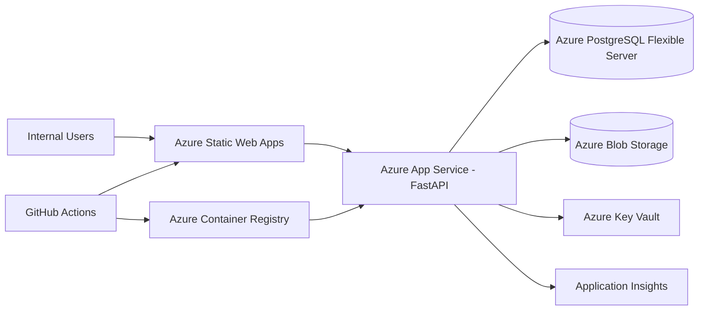

# Phase 2 — Azure Deployment Guide

This document describes how to deploy the Optimal Estimate Calculator from the Phase 1 local MVP to Azure staging and production.

## Architecture



| Component | Azure service | Purpose |
|-----------|---------------|---------|
| Frontend | Static Web Apps | Next.js UI, API proxy routes |
| Backend | App Service (Linux container) | FastAPI API, PDF generation |
| Database | PostgreSQL Flexible Server | Jobs, quotes, rules, audit |
| Documents | Blob Storage | Generated quote PDFs/HTML |
| Secrets | Key Vault | `SECRET_KEY`, `DATABASE_URL` |
| Telemetry | Application Insights | Logs, traces, metrics |
| CI/CD | GitHub Actions | Test, migrate, deploy |

---

## 1. Azure Blob Storage adapter

PDF documents are stored through a storage abstraction:

| File | Role |
|------|------|
| `backend/app/adapters/pdf_storage.py` | Factory — selects backend from `STORAGE_BACKEND` |
| `backend/app/adapters/local_pdf_storage.py` | Local filesystem (development) |
| `backend/app/adapters/azure_blob_storage.py` | Azure Blob Storage (staging/production) |
| `backend/app/adapters/pdf_renderer.py` | Shared Jinja2 + WeasyPrint rendering |

### Configuration

```bash
STORAGE_BACKEND=azure_blob
AZURE_STORAGE_ACCOUNT_NAME=estimateprodstorage
AZURE_STORAGE_CONTAINER_NAME=quote-documents
AZURE_STORAGE_USE_MANAGED_IDENTITY=true
AZURE_STORAGE_BLOB_PREFIX=quotes
```

For local Azure testing, set `AZURE_STORAGE_CONNECTION_STRING` instead of managed identity.

The `documents.file_path` column stores the blob key (e.g. `quotes/quote_Q-123_final_ab12cd34.pdf`).

### App Service managed identity

1. Enable **System assigned managed identity** on the App Service.
2. Grant **Storage Blob Data Contributor** on the storage account.
3. Set `AZURE_STORAGE_USE_MANAGED_IDENTITY=true`.

---

## 2. Production environment config

Environment-specific examples:

| File | Environment |
|------|-------------|
| `.env.example` | Local development |
| `backend/.env.staging.example` | Staging backend |
| `backend/.env.production.example` | Production backend |
| `.env.staging.example` | Staging root reference |
| `.env.production.example` | Production root reference |
| `frontend/.env.production.example` | Frontend build |

Key settings in `backend/app/core/config.py`:

| Variable | Description |
|----------|-------------|
| `ENVIRONMENT` | `development`, `staging`, or `production` |
| `LOG_LEVEL` | Python log level |
| `STORAGE_BACKEND` | `local` or `azure_blob` |
| `WEB_CONCURRENCY` | Gunicorn worker count |
| `PORT` | App Service port (default 8000) |
| `RUN_SEED` | Run seed on startup (`false` in prod) |

Health check: `GET /health` returns environment and storage backend.

---

## 3. Application Insights logging

Telemetry is configured in `backend/app/core/logging.py` and initialised on app startup.

```bash
ENABLE_APPLICATION_INSIGHTS=true
APPLICATIONINSIGHTS_CONNECTION_STRING=InstrumentationKey=...;IngestionEndpoint=...
```

When enabled, `azure-monitor-opentelemetry` auto-instruments FastAPI, HTTP clients, and logging.

View telemetry in Azure Portal → Application Insights → Logs / Transaction search.

---

## 4. Key Vault–ready settings

Two supported patterns:

### A. App Service Key Vault references (recommended)

Set App Service configuration values directly:

```
SECRET_KEY=@Microsoft.KeyVault(SecretUri=https://estimate-kv-prod.vault.azure.net/secrets/SECRET-KEY/)
DATABASE_URL=@Microsoft.KeyVault(SecretUri=https://estimate-kv-prod.vault.azure.net/secrets/DATABASE-URL/)
```

App Service resolves these at runtime — no code changes required.

### B. Programmatic Key Vault loading

```bash
USE_KEY_VAULT=true
KEY_VAULT_URL=https://estimate-kv-prod.vault.azure.net/
KEY_VAULT_SECRET_KEY_NAME=SECRET-KEY
KEY_VAULT_DATABASE_URL_NAME=DATABASE-URL
```

The App Service managed identity needs **Key Vault Secrets User** on the vault.

---

## 5. Azure App Service backend startup

| File | Purpose |
|------|---------|
| `backend/startup.sh` | Production startup: migrate → optional seed → Gunicorn |
| `backend/Dockerfile` | Container image with WeasyPrint dependencies |

### App Service configuration

| Setting | Value |
|---------|-------|
| Startup command | `./startup.sh` |
| Port | `8000` |
| Always On | Enabled |
| HTTPS only | Enabled |

`startup.sh` runs:

1. `alembic upgrade head`
2. Optional `python -m app.db.seed` when `RUN_SEED=true`
3. Gunicorn with `uvicorn.workers.UvicornWorker`

---

## 6. Azure Static Web Apps frontend config

| File | Purpose |
|------|---------|
| `frontend/staticwebapp.config.json` | Routes, API proxy, security headers |
| `frontend/next.config.mjs` | Optional `standalone` output for container deploy |

### API proxy

`staticwebapp.config.json` rewrites `/api/*` to the backend App Service URL. Update the rewrite target per environment:

```json
{
  "route": "/api/*",
  "rewrite": "https://estimate-api-staging.azurewebsites.net/api/*"
}
```

### Build-time API URL

Set during GitHub Actions deploy:

```bash
NEXT_PUBLIC_API_URL=https://estimate-api-staging.azurewebsites.net
```

---

## 7. GitHub Actions pipelines

| Workflow | Trigger | Purpose |
|----------|---------|---------|
| `.github/workflows/ci.yml` | PR + push to `main` | Backend pytest, frontend lint + build |
| `.github/workflows/deploy-staging.yml` | Push to `main`, manual | Migrate, deploy backend + frontend to staging |
| `.github/workflows/deploy-production.yml` | Manual only | Migrate, deploy backend + frontend to production |

### Required GitHub secrets

| Secret | Used for |
|--------|----------|
| `AZURE_CREDENTIALS` | Service principal JSON for `azure/login` |
| `STAGING_DATABASE_URL` | Alembic migrate (staging) |
| `PRODUCTION_DATABASE_URL` | Alembic migrate (production) |
| `AZURE_STATIC_WEB_APPS_API_TOKEN_STAGING` | SWA deploy token |
| `AZURE_STATIC_WEB_APPS_API_TOKEN_PROD` | SWA deploy token |

### Required GitHub variables

| Variable | Example |
|----------|---------|
| `AZURE_RESOURCE_GROUP_STAGING` | `rg-estimate-staging` |
| `AZURE_WEBAPP_NAME_STAGING` | `estimate-api-staging` |
| `AZURE_RESOURCE_GROUP_PROD` | `rg-estimate-prod` |
| `AZURE_WEBAPP_NAME_PROD` | `estimate-api-prod` |
| `AZURE_CONTAINER_REGISTRY` | `estimateacr` |
| `STAGING_API_URL` | `https://estimate-api-staging.azurewebsites.net` |
| `PRODUCTION_API_URL` | `https://estimate-api.optimal.example` |

### GitHub environments

Create **staging** and **production** environments with required reviewers for production deploys.

---

## 8. Alembic deployment migration command

Run migrations before deploying new backend code:

```bash
cd backend
DATABASE_URL='postgresql+psycopg2://...' ./scripts/deploy-migrate.sh
```

Check for pending migrations (CI gate):

```bash
./scripts/deploy-migrate.sh --check
```

GitHub Actions runs migrations in dedicated jobs before App Service deploy.

For manual one-off runs from App Service SSH:

```bash
cd /app && alembic upgrade head
```

---

## 9. Staging vs production checklist

### Staging

- [ ] Resource group: `rg-estimate-staging`
- [ ] PostgreSQL Flexible Server with `sslmode=require`
- [ ] App Service (Linux, container) with managed identity
- [ ] Blob Storage account + `quote-documents` container
- [ ] Key Vault with staging secrets
- [ ] Application Insights workspace
- [ ] Static Web Apps (staging URL)
- [ ] ACR image pull enabled on App Service
- [ ] CORS: staging SWA URL
- [ ] `RUN_SEED=true` only for first deploy, then `false`
- [ ] GitHub environment: `staging`

### Production

- [ ] Separate resource group and Key Vault
- [ ] Production PostgreSQL with backup retention + HA tier
- [ ] Custom domain + TLS on SWA and App Service
- [ ] Key Vault references for all secrets (no plain-text)
- [ ] `LOG_LEVEL=WARNING`, `RUN_SEED=false`
- [ ] Alert rules on App Insights (5xx rate, latency, DB connections)
- [ ] GitHub environment: `production` with manual approval
- [ ] Deploy via **Deploy Production** workflow only

---

## 10. First-time Azure provisioning (summary)

1. **Create resources** — PostgreSQL, Storage, Key Vault, App Insights, ACR, App Service, Static Web App.
2. **Store secrets** in Key Vault: `SECRET-KEY`, `DATABASE-URL`.
3. **Configure App Service** app settings from `backend/.env.production.example`, using Key Vault references.
4. **Grant managed identity** access to Blob Storage and Key Vault.
5. **Configure GitHub** secrets and variables listed above.
6. **Run CI** — confirm tests pass on `main`.
7. **Deploy staging** — run `Deploy Staging` workflow, verify `/health` and login.
8. **Deploy production** — run `Deploy Production` workflow after staging sign-off.

---

## Local verification

```bash
# Backend tests (includes storage factory)
cd backend && pytest -q

# Production-like container
cd backend
docker build -t estimate-backend .
docker run --env-file .env.example -p 8000:8000 estimate-backend

# Frontend production build
cd frontend
NEXT_PUBLIC_API_URL=http://localhost:8000 npm run build
```

---

## Troubleshooting

| Symptom | Check |
|---------|-------|
| PDF upload fails | Managed identity has Blob Data Contributor; container exists |
| 502 on App Service | `startup.sh` logs; WeasyPrint system libs in container |
| CORS errors | `CORS_ORIGINS` includes exact SWA URL (no trailing slash mismatch) |
| DB connection fails | `sslmode=require` in `DATABASE_URL`; firewall allows Azure services |
| No telemetry | `ENABLE_APPLICATION_INSIGHTS=true` and connection string set |
| Migrations fail | `DATABASE_URL` secret correct; user has DDL permissions |

---

## Related files

```
backend/
  app/adapters/azure_blob_storage.py
  app/adapters/pdf_storage.py
  app/core/config.py
  app/core/logging.py
  startup.sh
  scripts/deploy-migrate.sh
  .env.staging.example
  .env.production.example
frontend/
  staticwebapp.config.json
  .env.production.example
.github/workflows/
  ci.yml
  deploy-staging.yml
  deploy-production.yml
```
